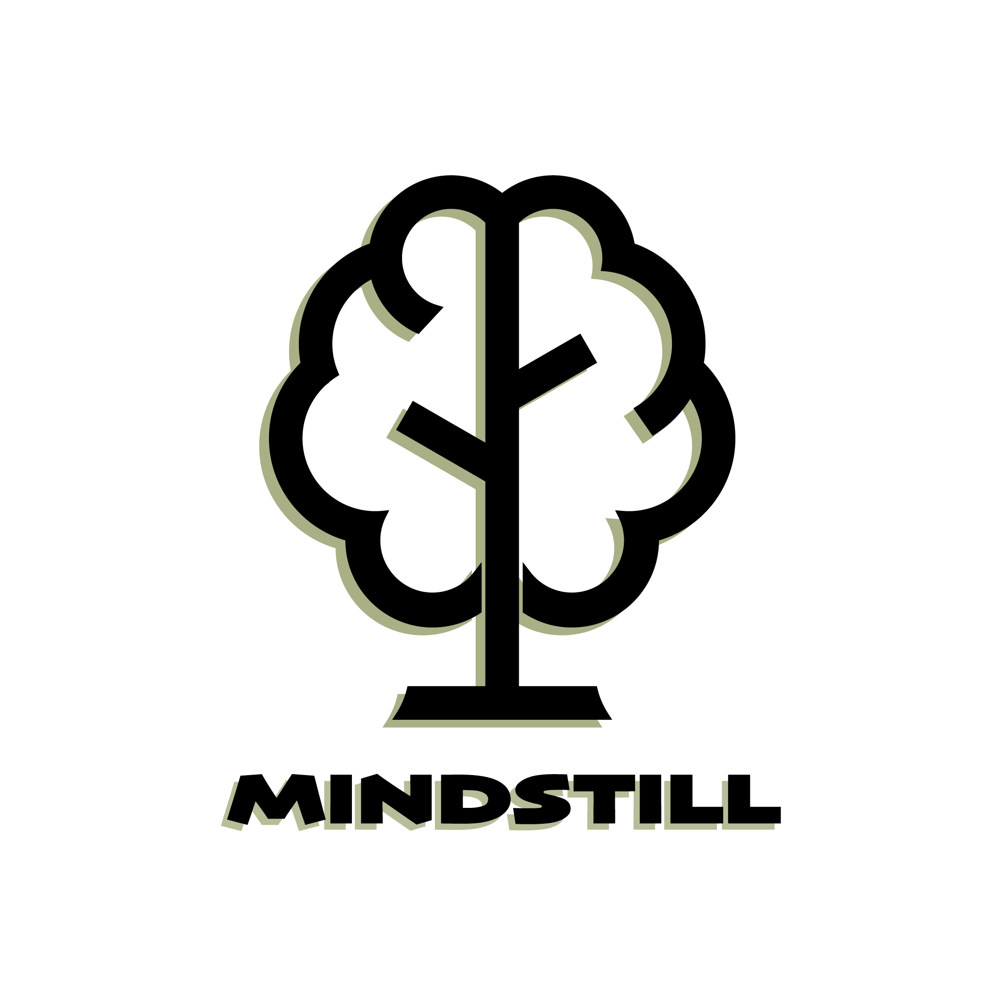

# mindstill

<p align="center">
  
</p>

> Distill the essence from your spoken words.
> Build a living tree of your thinking.

---

*mindstill* is an **open-source pipeline of AI Skills** that transforms raw, unstructured speech into a structured, evolving personal knowledge system.

You speak. It listens, filters, distills, probes, perspective-shifts, links, and archives — growing a tree of thought that others can one day converse with.

---

## Philosophy

Most of what we say is noise. But buried in the noise are insights — fleeting, partial, but real. Each insight is a *collapsed face* of a larger truth.

mindstill doesn't pretend to see the whole elephant. It collects the fragments, one by one, and assembles them through a medium of symbolic integration: **your own thought system, written in Markdown.**

> *Fragment → Distill → Probe → Perspective-shift → Link → Archive → Grow*

---

## Pipeline

```
Your Voice / Text
      │
      ▼
┌──────────┐
│ gatekeeper   Does this contain a real judgment grounded in something objective?
└─────┬────┘
      ▼
┌──────────┐
│ distiller    Strip the filler. Find the conclusion. Keep the analogy intact.
└─────┬────┘
      ▼
┌──────────┐
│ prober       Ask "so what?" three times. Stop when it's deep enough.
└─────┬────┘
      ▼
┌──────────┐
│ perspector   Five lenses: objective, subjective, entanglement, collapsed face, medium.
└─────┬────┘
      ▼
┌──────────┐
│ linker       Detect dimensional intersections between fragments.
└─────┬────┘
      ▼
┌──────────┐
│ formatter    Archive: timestamp, description, conclusion & its basis.
└─────┬────┘
      ▼
Your Thought Tree (Markdown files, 6-layer structure)
```

---

## The 6-Layer Tree

| Layer | What lives here |
|:------|:----------------|
| `00_认知地基` | How you believe you come to know things (epistemology) |
| `01_价值观` | Unshakable beliefs, right/wrong anchors |
| `02_方法论` | Thinking tools, frameworks, decision models |
| `03_规则边界` | Gray zones, exceptions, elastic standards |
| `04_阅历感悟` | Stories, lessons, lived experience |
| `05_此刻灵感` | Fleeting ideas, projects in flight |

You define the layers. The pipeline fills them.

---

## How to Use

### With pi agent

Clone this repo into `~/.pi/skills/`, then say:

> *"记一下"* (archive this) — full pipeline, auto-archives
> *"我跟你说"* (listen to this) — filters first, archives if worthy

### With your own agent

Each skill is a standalone Markdown file with a prompt template. Feed it to any LLM. The `orchestrator` skill defines how they chain together.

---

## What's Not Here

This is the **scaffolding**. The following are **yours to build**:

- Your actual thought content
- Your personal classification taxonomy
- Your validator casebook
- Your thought tree files

This repo gives you the tools. The house is yours.

---

## Install

```bash
git clone https://github.com/ArtiNexus/mindstill.git ~/.pi/skills/mindstill
```

---

## Languages

[中文文档](README.zh.md)

---

*Built with [pi agent](https://github.com/earendil-works/pi).*
*Inspired by collapse states, superposition, and the blind men and the elephant.*
